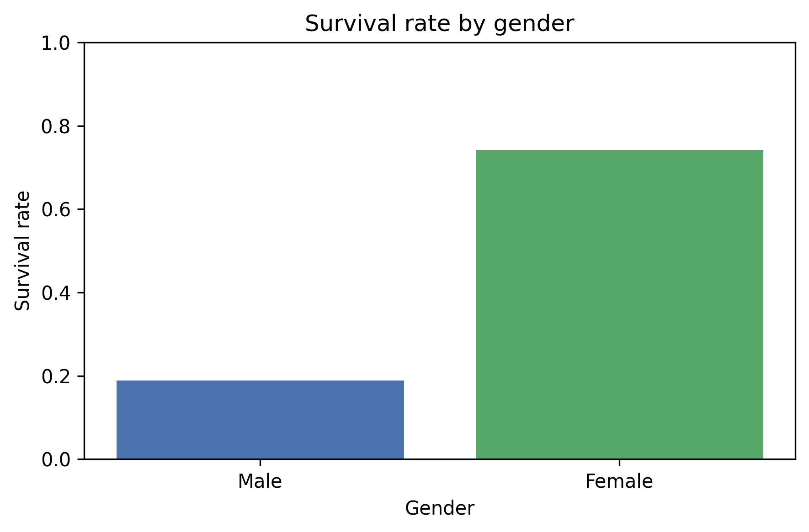
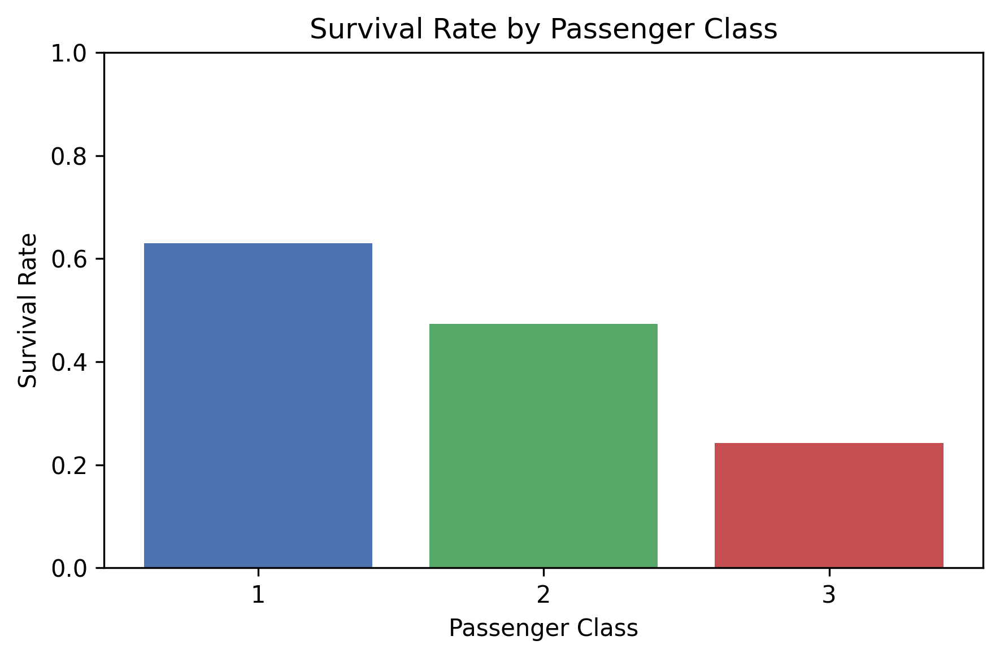
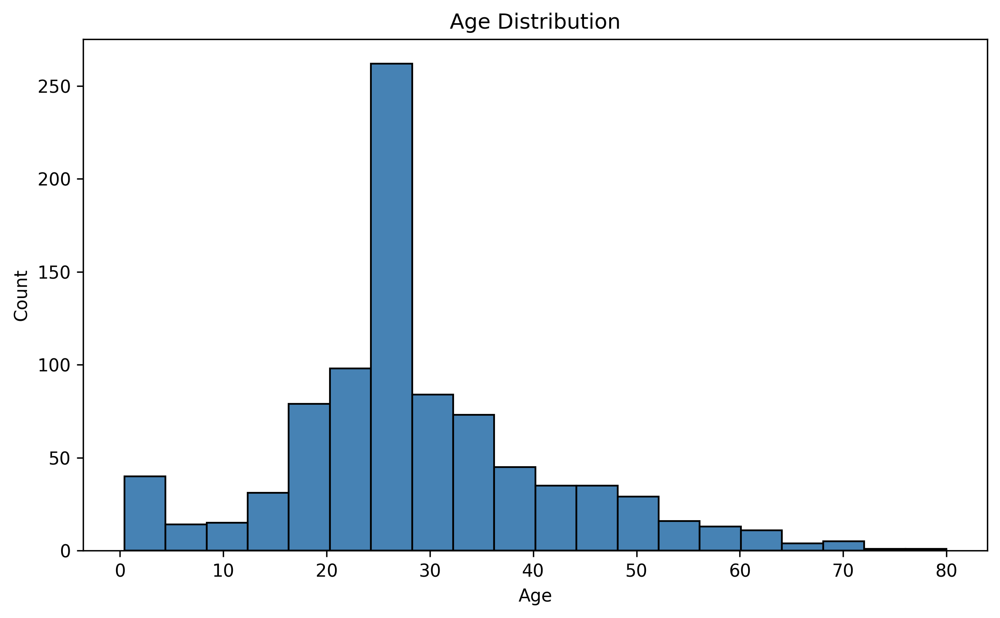

# Titanic Data Analysis

用 pandas 和 matplotlib 对泰坦尼克号乘客数据做探索性分析。

## 数据来源
Kaggle Titanic: https://www.kaggle.com/c/titanic

## 做了什么
- 数据清洗：Age 用中位数填充、Embarked 用众数填充、删除 Cabin 列、Sex 转成 0/1
- 统计分析：整体存活率、性别存活率、舱位存活率、年龄分布

## 图表

## 运行方式
pip install -r requirements.txt
python titanic_analysis.py